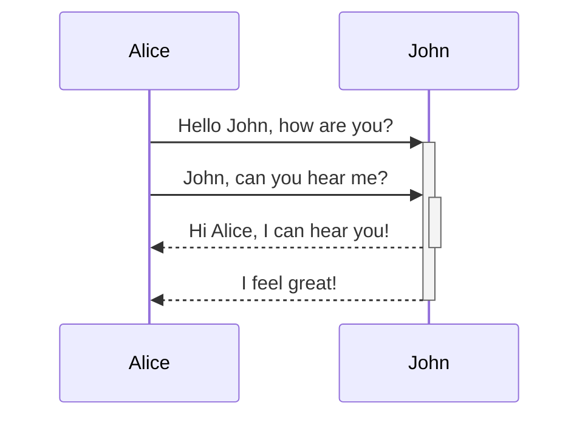

Aufgrund des Praxisbezugs des Informatik Studiums, wurden Projektarbeiten eingeführt, welche in Teams zu je vier Studenten bearbeitet werden sollen.
Die Teams sind für die Arbeitsaufteilung innerhalb der Gruppe selbst verantwortlich.
Bei dem hier betrachteten Team ergab sich folgende Tabelle:

| Mitglied | Codeanteil (in \%) | Fehler (in \%) |
| ---      | ---                |---             |
| 1        | 20                 | 1,25           |
| 2        | 20                 | 2,5            |
| 3        | 20                 | 5              |
| 4        | 40                 | 1,875          |

Dem fertigen Code ist nicht mehr anzusehen, von welchem Teammitglied er programmiert worden ist.
Aus der Masse an Code wird rein zufällig eine Zeile herausgegriffen und auf Fehler überprüft.

Folgende [[ereignis|Ereignisse]] werden formuliert:

$$
A_i = \{ \text{Der Code wurde von Teammitglied $i$ programmiert} \} \quad (i = 1,2,3,4) 
$$

$$
	B = \{ \text{Der Code ist fehlerhaft} \}
$$

1. Formulieren Sie die Fehlerwahrscheinlichkeiten als [[bedingte-wahrscheinlichkeit|bedingte Wahrscheinlichkeiten]] und zeichnen Sie den *Wahrscheinlichkeitsbaum*.
2. Berechnen Sie die Wahrscheinlichkeit, dass die zufällig herausgegriffene Codezeile fehlerhaft ist.
3. Wie groß ist die Wahrscheinlichkeit, dass ein fehlerhafter Code von Teammitglied $i$ programmiert worden ist?

<blockquote>
Folgende [[ereignis|Ereignisse]] werden formuliert:

$$
	A_i = \{ \text{Der Code wurde von Teammitglied $i$ programmiert} \} \quad (i = 1,2,3,4) 
$$
$$
B = \{ \text{Der Code ist fehlerhaft} \}
$$
 
1. Formulieren Sie die Fehlerwahrscheinlichkeiten als [[bedingte-wahrscheinlichkeit|bedingte Wahrscheinlichkeiten]] und zeichnen Sie den *Wahrscheinlichkeitsbaum*.
2. Berechnen Sie die Wahrscheinlichkeit, dass die zufällig herausgegriffene Codezeile fehlerhaft ist.
3. Wie groß ist die Wahrscheinlichkeit, dass ein fehlerhafter Code von Teammitglied $i$ programmiert worden ist?
<blockquote>
Folgende [[ereignis|Ereignisse]] werden formuliert:

$$
	A_i = \{ \text{Der Code wurde von Teammitglied $i$ programmiert} \} \quad (i = 1,2,3,4) 
$$
$$
B = \{ \text{Der Code ist fehlerhaft} \}
$$
 
1. Formulieren Sie die Fehlerwahrscheinlichkeiten als [[bedingte-wahrscheinlichkeit|bedingte Wahrscheinlichkeiten]] und zeichnen Sie den *Wahrscheinlichkeitsbaum*.
2. Berechnen Sie die Wahrscheinlichkeit, dass die zufällig herausgegriffene Codezeile fehlerhaft ist.
3. Wie groß ist die Wahrscheinlichkeit, dass ein fehlerhafter Code von Teammitglied $i$ programmiert worden ist?
</blockquote>
</blockquote>

1. Für die bedingten Fehlerwahrscheinlichkeiten gilt nach Voraussetzung:
	$$ P(B \mid A_1) = 1.25\% $$
	$$ P(B \mid A_2) = 2.5\% $$
	$$ P(B \mid A_3) = 5\% $$
	$$ P(B \mid A_4) = 1.875\% $$
	
	Der Wahrscheinlichkeitsbaum sieht dann wie folgt aus:

```mermaid
graph TD;
Root[Start] -- 20% --A1[Mitglied 1];
Root[Start] -- 20% --A2[Mitglied 2];
Root[Start] -- 20% --A3[Mitglied 3];
Root[Start] -- 40% --A4[Mitglied 4];
A1 -- 1,25% --!B1[Fehler];
A1 -- 98,75% --B1[OK];
A2 -- 2,5% --!B2[Fehler];
A2 -- 97,5% --B2[OK];
A3 -- 5% --!B3[Fehler];
A3 -- 95% --B3[OK];
A4 -- 1,875% --!B4[Fehler];
A4 -- 98,125% --B4[OK];
```


	```mermaid
	graph
	  Root[Start] -- 20% --> A1[Mitglied 1]
	  Root[Start] -- 20% --> A2[Mitglied 2]
	  Root[Start] -- 20% --> A3[Mitglied 3]
	  Root[Start] -- 40% --> A4[Mitglied 4]
	  A1 -- 1,25% --> !B1[Fehler]
	  A1 -- 98,75% --> B1[OK]
	  A2 -- 2,5% --> !B2[Fehler]
	  A2 -- 97,5% --> B2[OK]
	  A3 -- 5% --> !B3[Fehler]
	  A3 -- 95% --> B3[OK]
	  A4 -- 1,875% --> !B4[Fehler]
	  A4 -- 98,125% --> B4[OK]
	```

2. Um zu berechnen, wie hoch die Wahrscheinlichkeit ist, dass eine herausgegriffene Codezeile fehlerhaft ist, berechnet man die Summe der Wahrscheinlichkeiten, dass eine Codezeile fehlerhaft ist und gleichzeitig von Mitglied $i$ verfasst wurde.
   $$
   P(B) = \sum_{i = 1}^4 P(A_i \cap B) = 0.2 \cdot 0.0125 + 0.2 \cdot 0.025 + 0.2 \cdot 0.05 + 0.4 \cdot 0.01875 = 0.025
  $$

3. Um zu bestimmen, mit welcher Wahrscheinlichkeit eine fehlerhafte Codezeile von Mitglied $i$ stammt, nutzt man die [[Bayes'sche Formel|Formel von Bayes]]:
   $$
   P(A_i \mid B)  = \frac{P(A_i \cap B)}{P(B)}
  $$

   $$
   P(A_i \mid B)  = \frac{P(A_i \cap B)}{P(B)}
  $$
  
Daraus folgt für Mitglied 1:
	$$
		P(A_1 \mid B) = \frac{P(A_1 \cap B)}{P(B)} = \frac{0.2 \cdot 0.0125}{0.025}   = 0.1,
	$$
	für Mitglied 1:
	$$
		P(A_2 \mid B)  = \frac{P(A_2 \cap B)}{P(B)} = \frac{0.2 \cdot 0.025}{0.025} = 0.2,
	$$
	 für Mitglied 3:
	$$
		P(A_3 \mid B)  = \frac{P(A_3 \cap B)}{P(B)} = \frac{0.2 \cdot 0.05}{0.025} = 0.4
	$$
	und für Mitglied 4:
	$$
		P(A_4 \mid B)  = \frac{P(A_4 \cap B)}{P(B)} = \frac{0.4 \cdot 0.01875}{0.025}  = 0.3.
	$$